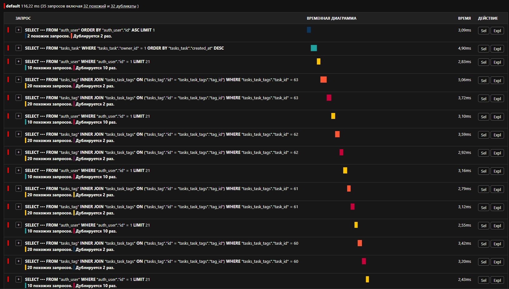
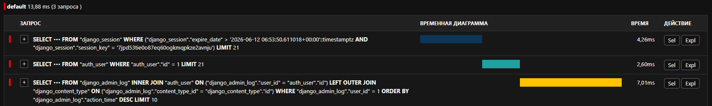

## До:



## После:



### ORM команда

```commandline
from django.contrib.auth import get_user_model
from tasks.models import Task, Tag

User = get_user_model()
user = User.objects.first()

tag1, _ = Tag.objects.get_or_create(name="Backend", owner=user)
tag2, _ = Tag.objects.get_or_create(name="Refactoring", owner=user)
tag3, _ = Tag.objects.get_or_create(name="Highload", owner=user)

for i in range(1, 11):
    task = Task.objects.create(
        title=f"Demo Task #{i}",
        description="Analyzing N+1 query problem with Django Debug Toolbar",
        owner=user
    )
    task.tags.add(tag1, tag2, tag3)

print("Success! 10 English tasks with tags have been created")
```